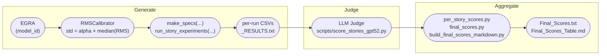

<div align="center">

# Noise Steering for Controlled Text Generation: Improving Diversity and Reading-Level Fidelity in Arabic Educational Story Generation

<br>


<br>

### Haziq Mohammad Khalid, Salsabeel Shapsough, Imran Zualkernan 
### American University of Sharjah
#### Presented at BEA @ ACL 26'
[](https://arxiv.org/abs/2604.03380)
</div>
<hr>

Training-free **noise steering**: inject calibrated Gaussian perturbations into the
internal representations of transformer LLMs at inference time to improve the
*diversity* of Arabic Early-Grade Reading Assessment (EGRA) stories without losing
quality, constraint adherence, or early-grade reading level.

This repository contains the code behind the paper (Presented at BEA @ ACL 26').

The method injects noise at four sites and compares them against high-temperature
sampling baselines:

- **Embedding noise** — perturb the token-embedding output (earliest injection site).
- **Attention-logit noise** — perturb the self-attention output (after `W_O`, before MLP/residual add).
- **Residual stream noise (L-Res)** — perturb the full block output (most reliable method).
- **Attention Entropy Noise Injection (AENI)** — scale attention-output noise by how *peaked* the attention is.

A cosine **noise decay** schedule reduces perturbation as generation progresses so the
model explores early and restores constraint-following later.

---

## Repository structure

```
.
├── noiseegra/                  
│   ├── EGRA_functions.py       # EGRA generation class + all noise-injection methods
│   ├── prompts.py              
│   ├── RMS_std.py              # RMSCalibrator: per-model noise-std calibration
│   ├── egra_constraint_checker.py  # Rule-based EGRA constraint checks
│   ├── creativity_metrics.py   # Vendi Score + Self-BLEU -> creativity score
│   ├── setup_experiment.py     
│   └── models/                 
│       ├── Jais.py  Fanar.py  Allam.py  AceGPT.py  Qween.py
├── scripts/                    
│   ├── score_stories_gpt52.py  # LLM-judge scoring (Azure OpenAI) -> SCORES/*_SCORE.csv
│   ├── per_story_scores.py     # per-story quality + total violations
│   ├── final_scores.py         
│   ├── build_final_scores_markdown.py  
│   ├── metrics_first30.py      # first-N capped metrics
│   ├── extract_parts_vendi.py  # split stories into Beginning/Middle/End for Vendi analysis (Not included in final paper)
├── examples/
│   └── main_eg.py              
├── pyproject.toml              
├── requirements.txt
└── .env.example                
```

---

## Installation

```bash
git clone https://github.com/haziq-exe/NoiseEGRA.git
cd NoiseEGRA

python -m venv .venv && source .venv/bin/activate
pip install -e .                                     
# or: pip install -r requirements.txt
```

Notes:

- A **CUDA GPU** is required for generation; models are loaded with `device_map="auto"` in `float16`.
- The newest models (e.g. **Jais-2**) may need `transformers` built from source:
  `pip install git+https://github.com/huggingface/transformers.git`
- The **LLM-judge** scoring scripts use **Azure OpenAI**. Copy `.env.example` to `.env`
  and fill in `AZURE_KEY` / `AZURE_ENDPOINT` / `AZURE_DEPLOYMENT`.

---

## End-to-end: running an experiment

The pipeline has three stages: **generate** stories (with optional noise) → **judge**
quality/constraints with an LLM → **aggregate** into summary tables.



### 1. Load a model

```python
from noiseegra.EGRA_functions import EGRA

model = EGRA("QCRI/Fanar-1-9B-Instruct")
# Equivalent convenience wrapper:
# from noiseegra.models.Fanar import Fanar
# model = Fanar()
```

Jais Model needs a dtype tweak:

```python
import torch
model.model = model.model.to(torch.bfloat16)
```

### 2. Calibrate the noise standard deviation

Noise is scaled to each model's own activation magnitude:
`std = alpha * median_layer(RMS)`. The paper uses **alpha = 0.175** for residual-stream
noise.

```python
import numpy as np
from noiseegra import prompts
from noiseegra.RMS_std import RMSCalibrator

cal = RMSCalibrator(model)
prompt = [
    {"role": "system", "content": prompts.SYS_ZERO_SHOT},
    {"role": "user",   "content": prompts.PROMPT_ZERO_SHOT},
]

layers = list(range(18, 27))                 # Fanar uses layers 18-26
rms = cal.collect_block_rms(prompt, layers=layers)   # residual stream
std = 0.175 * float(np.median(list(rms.values())))
print("calibrated residual std:", std)
```

`RMSCalibrator` also provides `collect_attn_rms(...)` (for attention/AENI noise) and
`collect_embedding_rms(...)` (for embedding noise), plus `alpha_from_target_std()` /
`std_for_model()` to transfer one alpha across models.

### 3. Build specs and generate

`make_specs(...)` accepts mode strings or dicts; `run_story_experiments(...)` writes one
CSV per run (`{run_id}.csv`, one story per row) and a `{model_name}_RESULTS.txt` report
(creativity + constraint adherence) into `output_dir`.

```python
from noiseegra.setup_experiment import make_specs, run_story_experiments

specs = make_specs({
    "mode": "residual_stream_noise",
    "residual_layers": layers,
    "residual_noise_std": std,
    "disable_residual_noise_decay": True,   # constant noise (paper "L-Res" runs use decay0)
    "temperature": 1.0,
})

outputs = run_story_experiments(
    model=model,
    model_name="Fanar",
    num_stories=(0, 50),                      # (start, end) story indices
    specs=specs,
    output_dir="experiment_results/ResidNoise",
    sanity_check=True, sanity_check_n=3,
)
```

You can pass several specs at once to compare conditions in one pass, e.g. a baseline,
a high-temperature baseline, and a noise method:

```python
specs = make_specs(
    "baseline",                                                   # noise-free, T=1.0
    {"mode": "baseline", "temperature": 1.8, "top_k": 40},        # high-temperature baseline
    {"mode": "residual_stream_noise", "residual_layers": layers,
     "residual_noise_std": std, "disable_residual_noise_decay": True},
)
```

#### Supported modes (`make_specs`)

| Mode string | Key parameters |
|---|---|
| `baseline` | `temperature`, `top_k`, `top_p`, `do_sample` |
| `residual_stream_noise` | `residual_layers`, `residual_noise_std`, `residual_noise_decay`, `disable_residual_noise_decay` |
| `attention_output_noise` | `attention_layers`, `attention_noise_std` |
| `attention_entropy_noise` (AENI) | `attn_entropy_layers`, `attn_entropy_noise_std`, `entropy_calc` |
| `embedding_noise` | `embed_noise_std` |

All modes also accept `max_noise_tokens` (cosine-decay horizon, default 200),
and the sampling params.

### 4. Score quality and constraints (LLM judge)

Requires `.env` with Azure OpenAI credentials. The judge rates each story (readability,
logic, grammar, reading level, modal collapse, structure, vocabulary, stereotypes,
gender balance) and writes `experiment_results/SCORES/<run>_SCORE.csv`.

```bash
python scripts/score_stories_gpt52.py
```

(By default it scores CSVs in `experiment_results/{AENIMaxW,baseline,EmbedNoise,ResidNoise,AttnNoise}`;
edit `INPUT_FOLDERS` in the script to point at your run folders.)

### 5. Aggregate into summary tables

```bash
python scripts/per_story_scores.py            # experiment_results/PER_STORY_SCORES/<run>.csv
python scripts/final_scores.py                # experiment_results/Final_Scores.txt
python scripts/build_final_scores_markdown.py # experiment_results/Final_Scores_Table.md
python scripts/metrics_first30.py             # first-N capped metrics (optional)
```

The rule-based EGRA checks and creativity scores can also be used directly:

```python
from noiseegra.creativity_metrics import CreativityScorer
from noiseegra.egra_constraint_checker import EGRAConstraintChecker

stories = outputs[next(iter(outputs))]
CreativityScorer(stories).creativity_score(print_report=True)
EGRAConstraintChecker().print_report(stories)
```

---

## Per-model settings used in the paper

Layer ranges and specific models used. RMS ceiling uses `alpha = 0.175 * median(block RMS)`.

| Model | HF model id | Layers |
|---|---|---|
| ALLaM 7B | `humain-ai/ALLaM-7B-Instruct-preview` | 12–20 |
| AceGPT 8B | `FreedomIntelligence/AceGPT-v2-8B-Chat` | 12–20 |
| Fanar 9B | `QCRI/Fanar-1-9B-Instruct` | 18–26 |
| Jais 8B | `inceptionai/Jais-2-8B-Chat` | 12–20 |
| Phi-4-mini | run via `EGRA("microsoft/Phi-4-mini-instruct")` | 12–20 |

> AENI requires attention weights, so build the model with eager attention:
> `EGRA(model_id, use_AENI=True)`.

Baselines: noise-free (`T=1.0`), high-temperature `T=1.8` with `top_k=40`, and
`T=1.8` with `top_p=0.9`.

---

Main findings: **residual-stream noise (L-Res)** and **AENI** are the only methods
that consistently improve diversity while preserving quality, constraint adherence, and
early-grade reading level — unlike high-temperature sampling, which inflates reading level
and triggers catastrophic collapse on several models.

---

## Citation

If you use our paper in your research, please cite our paper:

```bibtex
@misc{khalid2026noisesteeringcontrolledtext,
      title={Noise Steering for Controlled Text Generation: Improving Diversity and Reading-Level Fidelity in Arabic Educational Story Generation}, 
      author={Haziq Mohammad Khalid and Salsabeel Shapsough and Imran Zualkernan},
      year={2026},
      eprint={2604.03380},
      archivePrefix={arXiv},
      primaryClass={cs.CL},
      url={https://arxiv.org/abs/2604.03380}, 
}
```
