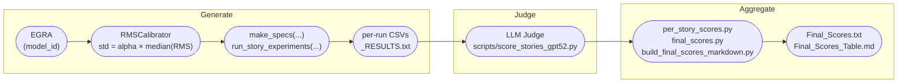

<div align="center">

# Noise Steering for Controlled Text Generation: Improving Diversity and Reading-Level Fidelity in Arabic Educational Story Generation

<br>


<br>

### Haziq Mohammad Khalid, Salsabeel Shapsough, Imran Zualkernan 
### American University of Sharjah
#### Presented at BEA @ ACL 26'
[](https://arxiv.org/abs/2604.03380)
</div>
<hr>

Training-free **noise steering**: inject calibrated Gaussian perturbations into the
internal representations of transformer LLMs at inference time to improve the
*diversity* of Arabic Early-Grade Reading Assessment (EGRA) stories without losing
quality, constraint adherence, or early-grade reading level.

This repository contains the code behind the paper (Presented at BEA @ ACL 26').

The method injects noise at four sites and compares them against high-temperature
sampling baselines:

- **Embedding noise** — perturb the token-embedding output (earliest injection site).
- **Attention-logit noise** — perturb the self-attention output (after `W_O`, before MLP/residual add).
- **Residual stream noise (L-Res)** — perturb the full block output (most reliable method).
- **Attention Entropy Noise Injection (AENI)** — scale attention-output noise by how *peaked* the attention is.

A cosine **noise decay** schedule reduces perturbation as generation progresses so the
model explores early and restores constraint-following later.

---

## Repository structure

```
.
├── noiseegra/                  
│   ├── EGRA_functions.py       # EGRA generation class + all noise-injection methods
│   ├── prompts.py              
│   ├── RMS_std.py              # RMSCalibrator: per-model noise-std calibration
│   ├── egra_constraint_checker.py  # Rule-based EGRA constraint checks
│   ├── creativity_metrics.py   # Vendi Score + Self-BLEU -> creativity score
│   ├── defaults.py             # Paper hyperparameters (alpha, layer ranges, etc.)
│   ├── setup_experiment.py     
│   └── models/                 
│       ├── Jais.py  Fanar.py  Allam.py  AceGPT.py  Qween.py
├── scripts/                    
│   ├── score_stories_gpt52.py  # LLM-judge scoring (Azure OpenAI) -> SCORES/*_SCORE.csv
│   ├── per_story_scores.py     # per-story quality + total violations
│   ├── final_scores.py         
│   ├── build_final_scores_markdown.py  
│   ├── collect_run_results.py  
│   ├── split_combined_results.py  
│   ├── metrics_first30.py      # optional first-N capped metrics (default N=50)
│   ├── extract_parts_vendi.py  # split stories into Beginning/Middle/End (not in final paper)
├── examples/
│   └── main_eg.py              
├── pyproject.toml              
├── requirements.txt
└── .env.example                
```

---

## Installation

```bash
git clone https://github.com/haziq-exe/NoiseEGRA.git
cd NoiseEGRA

python -m venv .venv && source .venv/bin/activate
pip install -e .                                     
# or: pip install -r requirements.txt
```

Notes:

- A **CUDA GPU** is required for generation; models load with `device_map="auto"` (`float16` by default; the `Jais` wrapper uses `bfloat16` when supported).
- The newest models (e.g. **Jais-2**) may need `transformers` built from source:
  `pip install git+https://github.com/huggingface/transformers.git`
- **LLM-judge** scripts require Azure OpenAI. Copy `.env.example` to `.env` and set **all** of:
  `AZURE_KEY`, `AZURE_ENDPOINT`, `AZURE_DEPLOYMENT`
- Override the results root with env var `EGRA_RESULTS_DIR` or `--results-dir` on scripts.

---

## End-to-end: running an experiment

The pipeline has three stages: **generate** stories (with optional noise) → **judge**
quality/constraints with an LLM → **aggregate** into summary tables.


```mermaid
flowchart LR

    subgraph Generate
        A(["EGRA<br/>(model_id)"])
        B(["RMSCalibrator<br/>std = alpha × median(RMS)"])
        C(["make_specs(...)<br/>run_story_experiments(...)"])
        D(["per-run CSVs<br/><model>_RESULTS.txt"])
        A --> B --> C --> D
    end

    subgraph Judge
        E(["LLM Judge<br/>scripts/score_stories_gpt52.py"])
    end

    subgraph Aggregate
        F(["per_story_scores.py<br/>final_scores.py<br/>build_final_scores_markdown.py"])
        G(["Final_Scores.txt<br/>Final_Scores_Table.md"])
        F --> G
    end

    D --> E --> F
```

### 1. Load a model

```python
from noiseegra.EGRA_functions import EGRA

model = EGRA("QCRI/Fanar-1-9B-Instruct")
# Equivalent convenience wrapper:
# from noiseegra.models.Fanar import Fanar
# model = Fanar()
```

For Jais, use the wrapper (handles dtype automatically):

```python
from noiseegra.models.Jais import Jais
model = Jais()
```

### 2. Calibrate the noise standard deviation

Noise is scaled to each model's own activation magnitude:
`std = alpha * median_layer(RMS)`. The paper uses **alpha = 0.175**.

```python
import numpy as np
from noiseegra import prompts
from noiseegra.RMS_std import RMSCalibrator
from noiseegra.defaults import MODEL_LAYER_RANGES, RMS_ALPHA

cal = RMSCalibrator(model)
prompt = [
    {"role": "system", "content": prompts.SYS_ZERO_SHOT},
    {"role": "user",   "content": prompts.PROMPT_ZERO_SHOT},
]

lo, hi = MODEL_LAYER_RANGES["Fanar"]
layers = list(range(lo, hi))
rms = cal.collect_block_rms(prompt, layers=layers)   # residual stream
std = RMS_ALPHA * float(np.median(list(rms.values())))
print("calibrated residual std:", std)
```

`RMSCalibrator` also provides `collect_attn_rms(...)` (for attention/AENI noise) and
`collect_embedding_rms(...)` (for embedding noise), plus `alpha_from_target_std()` /
`std_for_model()` to transfer one alpha across models.

### 3. Build specs and generate

`make_specs(...)` accepts mode strings or dicts; `run_story_experiments(...)` writes:

| Path | Contents |
|------|----------|
| `{output_dir}/{run_id}.csv` | One story per row (raw generation output) |
| `{output_dir}/RESULTS/{run_id}.txt` | Per-run creativity + constraint report |
| `{output_dir}/{model_name}_RESULTS.txt` | Combined report (all runs in one file) |

```python
from noiseegra.setup_experiment import make_specs, run_story_experiments

specs = make_specs({
    "mode": "residual_stream_noise",
    "residual_layers": layers,
    "residual_noise_std": std,
    "disable_residual_noise_decay": True,   # constant noise (paper "L-Res" runs use decay0)
    "temperature": 1.0,
})

outputs = run_story_experiments(
    model=model,
    model_name="Fanar",
    num_stories=(0, 50),                      # (start, end) story indices
    specs=specs,
    output_dir="experiment_results/ResidNoise",
    sanity_check=True, sanity_check_n=3,
)
```

You can pass several specs at once to compare conditions in one pass, e.g. a baseline,
a high-temperature baseline, and a noise method:

```python
specs = make_specs(
    "baseline",                                                   # noise-free, T=1.0
    {"mode": "baseline", "temperature": 1.8, "top_k": 40},        # high-temperature baseline
    {"mode": "residual_stream_noise", "residual_layers": layers,
     "residual_noise_std": std, "disable_residual_noise_decay": True},
)
```

#### Supported modes (`make_specs`)

| Mode string | Key parameters |
|---|---|
| `baseline` | `temperature`, `top_k`, `top_p`, `do_sample` |
| `residual_stream_noise` | `residual_layers`, `residual_noise_std`, `residual_noise_decay`, `disable_residual_noise_decay` |
| `attention_output_noise` | `attention_layers`, `attention_noise_std` |
| `attention_entropy_noise` (AENI) | `attn_entropy_layers`, `attn_entropy_noise_std`, `entropy_calc` |
| `embedding_noise` | `embed_noise_std` |

All modes also accept `max_noise_tokens` (cosine-decay horizon, default 200),
and the sampling params.

### 4. Score quality and constraints (LLM judge)

Requires a complete `.env` (see Installation). The judge rates each story and writes
`experiment_results/SCORES/<run>_SCORE.csv`.

```bash
pip install -e ".[judge]"
python scripts/score_stories_gpt52.py
# Custom folders: python scripts/score_stories_gpt52.py --input-dirs ResidNoise --input-dirs baseline
# Custom root:     python scripts/score_stories_gpt52.py --results-dir /path/to/experiment_results
```

By default it scores CSVs in `experiment_results/{AENIMaxW,baseline,EmbedNoise,ResidNoise,AttnNoise}`.

### 5. Aggregate into summary tables

Copy per-run RESULTS into the top-level folder expected by aggregation (once per condition folder):

```bash
python scripts/collect_run_results.py
# Legacy combined files: python scripts/split_combined_results.py experiment_results/ResidNoise/Fanar_RESULTS.txt
```

Then aggregate (quality = mean of Readability, Logic, GrammarandLinguistics; stories aligned by `Story number`):

```bash
python scripts/per_story_scores.py            # experiment_results/PER_STORY_SCORES/<run>.csv
python scripts/final_scores.py                # experiment_results/Final_Scores.txt
python scripts/build_final_scores_markdown.py # experiment_results/Final_Scores_Table.md
python scripts/metrics_first30.py --first-n 30  # optional; default cap is 50
```

All aggregation scripts accept `--results-dir`.

The rule-based EGRA checks and creativity scores can also be used directly:

```python
from noiseegra.creativity_metrics import CreativityScorer
from noiseegra.egra_constraint_checker import EGRAConstraintChecker

stories = outputs[next(iter(outputs))]
CreativityScorer(stories).creativity_score(print_report=True)
EGRAConstraintChecker().print_report(stories)
```

---

## Per-model settings used in the paper

Layer ranges and HF ids are centralized in `noiseegra.defaults` (`MODEL_LAYER_RANGES`, `MODEL_HF_IDS`). RMS ceiling uses `alpha = 0.175 * median(block RMS)`.

| Model | HF model id | Layers |
|---|---|---|
| ALLaM 7B | `humain-ai/ALLaM-7B-Instruct-preview` | 12–20 |
| AceGPT 8B | `FreedomIntelligence/AceGPT-v2-8B-Chat` | 12–20 |
| Fanar 9B | `QCRI/Fanar-1-9B-Instruct` | 18–26 |
| Jais 8B | `inceptionai/Jais-2-8B-Chat` | 12–20 |
| Phi-4-mini | run via `EGRA("microsoft/Phi-4-mini-instruct")` | 12–20 |

> AENI requires attention weights, so build the model with eager attention:
> `EGRA(model_id, use_AENI=True)`.

Baselines: noise-free (`T=1.0`), high-temperature `T=1.8` with `top_k=40`, and
`T=1.8` with `top_p=0.9`.

---

Main finding: **residual-stream noise (L-Res)** and **AENI** are the only methods
that consistently improve diversity while preserving quality, constraint adherence, and
early-grade reading level — unlike high-temperature sampling, which inflates reading level
and triggers catastrophic collapse on several models.

---

## Citation

If you use our paper in your research, please cite our paper:

```bibtex
@misc{khalid2026noisesteeringcontrolledtext,
      title={Noise Steering for Controlled Text Generation: Improving Diversity and Reading-Level Fidelity in Arabic Educational Story Generation}, 
      author={Haziq Mohammad Khalid and Salsabeel Shapsough and Imran Zualkernan},
      year={2026},
      eprint={2604.03380},
      archivePrefix={arXiv},
      primaryClass={cs.CL},
      url={https://arxiv.org/abs/2604.03380}, 
}
```

---

## Extension: orthogonal constraint steering with direction-constrained noise

An ablation that decomposes the published method's single isotropic perturbation
into a **signal** (constraint-directed steering) and a **noise** (diversity) term,
and then asks where the noise is allowed to live.

At every targeted layer and decode step the block output is perturbed by

```
delta = sum_c  beta_c * f_c(t) * rho * s_c        +   epsilon
        \_____________ steering ______________/       \_ noise _/
```

* `s_c` — unit steering direction for constraint `c`, from contrastive
  mean-difference (CAA), optionally orthogonalised against the other constraints.
* `rho` — the model's median block RMS, so `beta` is dimensionless and directly
  comparable to the paper's `alpha`.
* `f_c(t)` — per-constraint schedule (`constant`, `ramp`, `cosine_decay`,
  `linear_decay`).
* `epsilon` — Gaussian noise restricted to the orthogonal complement of the
  protected subspace (`orth`), confined to it (`para`), or unrestricted (`iso`,
  i.e. the published L-Res method).

### Steered constraints

| Constraint | Steering direction | Exact check (no LLM judge) |
|---|---|---|
| `length` | `closure` — narrative wrap-up vs. plot escalation | word count ≤ 60 |
| `present_tense` | present (المضارع) vs. past (الماضي) minimal pairs | fraction of finite verbs in the imperfect ≥ 0.8 |
| `simple_register` | short child register vs. elaborate literary MSA | mean ≤ 12 and longest ≤ 18 words per sentence |

Length is steered through *closure* rather than through long/short story examples:
a "short story" contrast confounds length with topic, whereas contrasting a
resolution against a complication isolates the discourse move that actually ends
a story. All three checks are deterministic — see `noiseegra/constraint_metrics.py`.
Install `camel-tools` (`pip install -e ".[arabic]"` then
`camel_data -i disambig-mle-calima-msa-r13`) for proper morphological
disambiguation; a documented regex fallback runs without it.

Baseline adherence, measured on the stories already in `experiment_results/`, so
every constraint has real headroom:

| Model | words ≤ 60 | present tense | simple register | mean viol. / 3 |
|---|---|---|---|---|
| Jais 8B | 54% | 14% | 92% | 1.40 |
| Phi-4-mini | 16% | 4% | 60% | 2.20 |
| AceGPT 8B | 16% | 10% | 44% | 2.30 |
| Fanar 9B | 6% | 10% | 36% | 2.48 |
| ALLaM 7B | 0% | 52% | 0% | 2.48 |

### Running it

```bash
# 1. extract and cache the steering vectors (once per model)
python scripts/build_steering_vectors.py --model Fanar

# 2. run the ablation
python scripts/run_orthosteer_experiment.py --model Fanar --suite core --num-stories 50
python scripts/run_orthosteer_experiment.py --model Fanar --suite all --dry-run   # list conditions first

# 3. score with the exact checks (add --diversity for Vendi + Self-BLEU)
python scripts/score_orthosteer.py --input-dir experiment_results/OrthoSteer
```

Suites: `core` (Baseline / L-Res / steer-only / steer + {orth, iso, para}),
`ortho` (steering-vector orthogonalisation: none vs. Gram–Schmidt vs. Löwdin),
`beta` (constraint-pressure sweep), `loo` (leave-one-out over constraints), `all`.

### Two things to know before interpreting the results

**1. `orth` is nearly a no-op unless the protected subspace is enlarged.** In a
`D`-dimensional residual stream a random draw already places only `k/D` of its
energy inside a `k`-dimensional subspace. With three mean directions and
`D = 4096` that is 0.07%, and `cos(orth_noise, iso_noise) > 0.9999`. Use
`--protect-rank` (default 8 principal components per constraint) to protect a
subspace large enough for the arms to separate. The informative contrast is the
three-way `orth` / `iso` / `para` comparison at matched total energy — if `orth ≈
iso` while `para` is destructive, the finding is that the constraint-carrying
subspace is a tiny, fragile, identifiable part of the stream, which is itself an
explanation for *why* generic noise steering works.

**2. Orthogonality holds at the injection site, at that step.** Once the
perturbed state enters the KV cache and passes through later layers the steering
and noise components mix. This is a per-site invariant, not a global one, and
should be stated as such.

`SteeringPlan.print_report()` prints the raw cosine similarities between the
constraint directions and how much of each direction survived orthogonalisation
(`retained`) — report both. Gram–Schmidt is order-dependent (the first constraint
keeps its direction, the last is amputated most); Löwdin is order-free and
minimum-change.

### Tests

```bash
python tests/test_subspace.py          # geometry, schedules, exact metrics
python tests/test_orthosteer_smoke.py  # extraction + hook + plumbing, tiny CPU model
```

---

## English generalisation: constrained creative writing on WritingPrompts

The same method, moved off Arabic EGRA and onto an English creative-writing task
with a stronger model, to test whether it generalises.

### Task

Prompts come from **WritingPrompts** (Fan et al., 2018; `euclaise/writingprompts`),
the r/WritingPrompts corpus that the CS4 creativity benchmark also builds on. Each
prompt is paired with a fixed set of four verifiable constraints:

| Constraint | Steering direction | Exact check |
|---|---|---|
| `length` | `closure` — resolution vs. plot escalation | word count ≤ 150 |
| `present_tense` | present vs. past minimal pairs | present finite verbs ÷ all finite verbs ≥ 0.8 |
| `simple_register` | plain prose vs. literary register | Flesch–Kincaid grade ≤ 6.0 |
| `dialogue` | quoted speech vs. reported speech | ≥ 1 quoted utterance |

Three mirror the Arabic constraints, so the cross-lingual claim is about the same
constraint *types*. `dialogue` is added because it asks for something to be
**present** rather than limiting something, which tests whether steering works in
both directions.

Two design choices worth stating:

**Why not CS4's own constraints.** CS4 scores constraint satisfaction with a
GPT-3.5 judge, and its constraints are instance-specific ("must be set in a small
coastal town"). A steering direction has to mean the same thing on every prompt —
there is no single direction for a coastal town, but there is one for present
tense. So we take the prompts and supply generic, programmatically checkable
constraints instead.

**Diversity is measured within a prompt.** Stories written from different prompts
are trivially dissimilar, so a diversity score pooled across prompts would mostly
measure the prompt set. The runner generates K stories per prompt and the scorer
computes Vendi and Self-BLEU per prompt group before averaging. This is a stronger
design than the Arabic study, which used a single fixed prompt.

### Models

Standard dense, text-only causal LMs that run in float16 on two T4s. No hybrid,
mixture-of-experts or multimodal models: the method is defined on the residual
stream of a standard transformer, and changing the architecture at the same time as
the language and the task would make any result impossible to attribute.

| Key | Model | Blocks | Steered layers | float16 size | Licence |
|---|---|---|---|---|---|
| `Qwen3-8B` (default) | `Qwen/Qwen3-8B` | 36 | 14–22 | ~16 GB | Apache 2.0 |
| `Llama-3.1-8B` | `meta-llama/Llama-3.1-8B-Instruct` | 32 | 12–20 | ~16 GB | gated |
| `Mistral-Nemo-12B` | `mistralai/Mistral-Nemo-Instruct-2407` | 40 | 15–23 | ~24 GB | Apache 2.0 |

Each layer band covers the same relative depth as the paper's (37%–62%). Qwen3's
reasoning mode is disabled — a visible chain of thought would contaminate the story
text and every constraint measured on it.

### Running it

```bash
# baseline vs. the method
python scripts/run_english_experiment.py --model Qwen3-8B --suite compare \
    --num-prompts 10 --stories-per-prompt 5

# the full noise ablation
python scripts/run_english_experiment.py --model Qwen3-8B --suite noise

python scripts/score_english.py --input-dir <out>/Qwen3-8B --diversity
```

`compare` is baseline against the proposed method and nothing else. `noise`,
`core`, `ortho`, `beta`, `loo` and `all` behave as in the Arabic pipeline. Runs are
checkpointed per story and resume on re-invocation.

Install `spacy` and `en_core_web_sm` for the tense check — English irregular verbs
make the no-model fallback genuinely approximate, and it says so at startup.

```bash
python tests/test_english_smoke.py   # task setup, checks, extraction, runner, scorer
```
